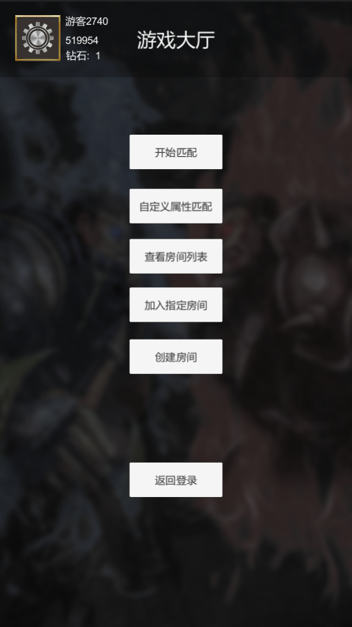
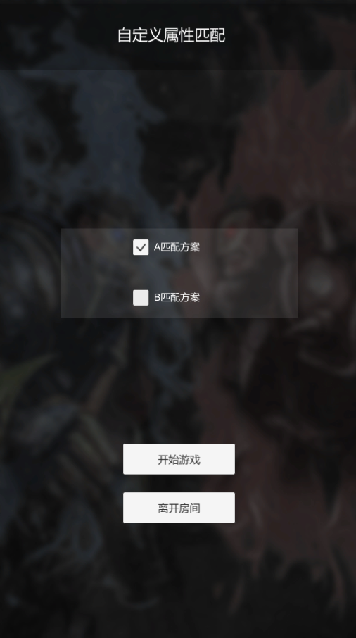
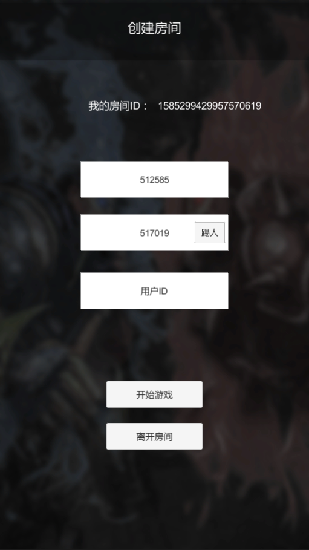
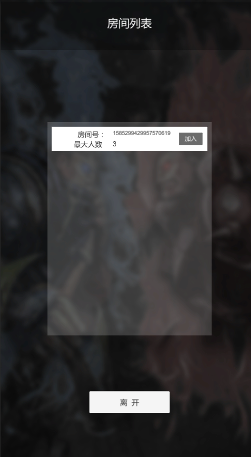
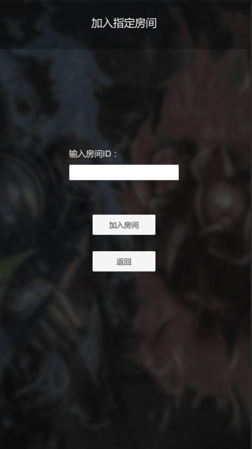
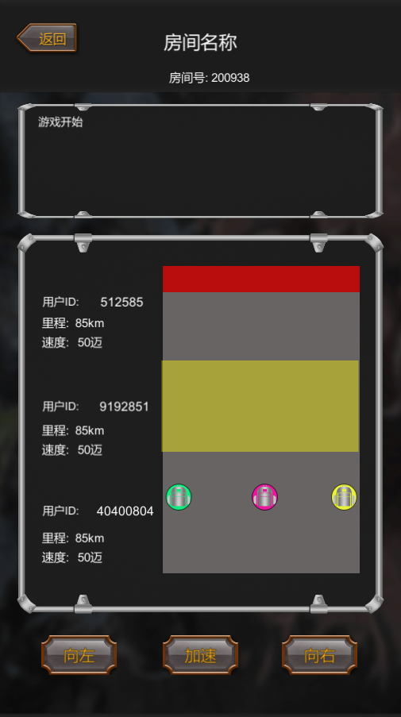

## Demo 简介

为了便于开发者使用和理解 MatchVS 的联网扩展功能，MatchVS 在联网基础的Demo之上提供了扩展演示。

您可以通过点击首页各个按钮进入对应的功能。





## 自定义属性匹配

Demo演示了根据玩家选择类型进行匹配，选择相同匹配类型的玩家会被匹配到一起。

**注意：** 属性匹配是将持有同样匹配规则的玩家匹配到一起。



自定义属性匹配:

```
  engine.joinRoomWithProperties(info, userProfile);
```

消息回调：

```
 int joinRoomResponse(MsJoinRandomRsp tRsp)
```

文件路径：`Assets\Script\MainUI\GameRoomBoard.cs `


Demo属性匹配代码如下:

```
		MsMatchInfoTag tag = null;
        if (SchemeA.isOn && SchemeB.isOn)
        {
            tag = new MsMatchInfoTag() {key = "key",value = "AB"};
        }

        if (SchemeA.isOn)
        {
            tag = new MsMatchInfoTag() { key = "key", value = "A" };
        }

        if (SchemeB.isOn) {
            tag = new MsMatchInfoTag() { key = "key", value = "B" };
        }
        MsMatchInfo info = new MsMatchInfo(3, 0, 0, tag);
        GameManager.MatchAttributeRoom(info, "matchvs");

```

文件路径：`Assets\Script\MainUI\MatchAttributeBoard.cs `


## 创建房间

玩家可以自己创建一个房间，点击Demo首页“创建房间”按钮即可提交创建，创建成功会返回当前房号。如果有其他玩家加入房间，房间内成员列表会更新。同时，房主拥有踢人权限。

如果房主中途离开房间，系统会自动指定下一个房主。




创建房间代码：

```
engine.createRoom(info, userProfile);
```

创建房间回调：

```
 int createRoomResponse(MsCreateRoomRsp tRsp)
```

踢人代码:

```
 engine.kickPlayer(userid,cpProto);
```

踢人回调:

```
int kickPlayerResponse(int status)
```

房间其他成员获取通知:

```
int kickPlayerNotify(MsKickPlayerNotify tRsp)
```

文件路径：`Assets\Script\MainUI\GameRoomBoard.cs`


Demo创建房间代码：

```
     MsCreateRoomInfo info = new MsCreateRoomInfo("MatchVS", 3, 0, 0, 0, "matchvs");
        GameManager.CreateRoom(info, "matchvs");
```

文件路径：`Assets\Script\MainUI\GameLobbyBoard.cs`

Demo踢人代码:

```
  GameManager.KickPlayer(userid,"matchvs");
```

文件路径：`Assets\Script\MainUI\CreateRoomPlayer.cs`

***注意：*** 只有房主拥有踢人的权利。


## 查看房间列表

点击Demo首页“查看房间列表”按钮即可查看当前所有玩家主动创建的房间列表。点击房间列表里的某个房间即可加入该房间。



获取房间列表:

```
engine.getRoomList(filter);
```

消息回调:

```
int getRoomListResponse(MsRoomListRsp tRsp)
```

文件路径：`Assets\Script\MainUI\GameRoomBoard.cs`


## 加入指定房间

点击Demo首页“加入指定房间”按钮即可通过输入房间号来加入某一个房间。



加入指定房间：

```
 engine.joinRoom(roomID, profile);
```

加入房间回调：

```
int joinRoomResponse(MsJoinRandomRsp tRsp)
```

文件路径：`Assets\Script\MainUI\GameRoomBoard.cs`


## 消息订阅分组

开始游戏后，游戏区域会有个黄色区域，黄色区域内的成员可以互相通信，圆圈内和圆圈外的成员不可以互相通信。

当成员进入黄色区域时即订阅消息，走出圆圈则取消订阅该范围消息。



订阅与取消订阅:

```
int subscribeEventGroup(string[] subGroups, string[] unsubGroups)
```

订阅与取消订阅回调:

```
int subscribeEventGroupRsp(MsSubscribeEventGroupRsp tRsp)
```

发送消息到消息订阅组:

```
int subscribeEventGroupRsp(MsSubscribeEventGroupRsp tRsp)
```
订阅消息推送:

```
int sendEventGroupNotify(MsSendEventGroupNotify tRsp)
```

文件路径：`Assets\Script\MainUI\GameRoomBoard.cs`
```

